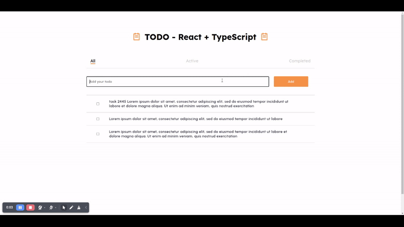

# TextUtils

Welcome to the Todo - React + Typescript GitHub repository!

Todo-RTS is a simple todo app that allows users to manage their todo lists. It provides an option to mark tasks as done and enables users to sort the task list using active and completed filters. The app uses the browser's local storage to store tasks.



## Installation

- Clone the repository:

```bash
  git clone https://github.com/swapnilghone/todo-rts.git
```
- Navigate to the project directory:
```bash
  cd todo-rts
```
- Install dependencies:
```bash
  npm install
```
## Usage

- To start the project:
```bash
npm run start
```
- To build the project:
```bash
npm run build
```

## Dependencies
- Node version: >=20.11.0
- Npm version: >=0.39.1
- React version: 18.2
- React router dom: 7.2
- Typescript: 5.6

## License

Todo-RTS is licensed under the MIT License - see the [LICENSE.TXT](LICENSE.TXT) file for details


## Authors

**Swapnil Ghone** - [Todo-RTS](https://github.com/swapnilghone/todo-rts)


## 🔗 Links
[](https://github.com/swapnilghone)

[](https://www.linkedin.com/in/swapnil-ghone/)

## Contributing

Contributions are always welcome!

Please feel free to fork the repository and submit pull requests.